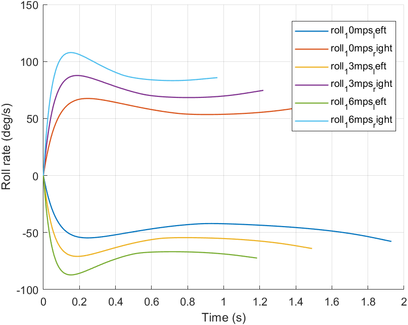
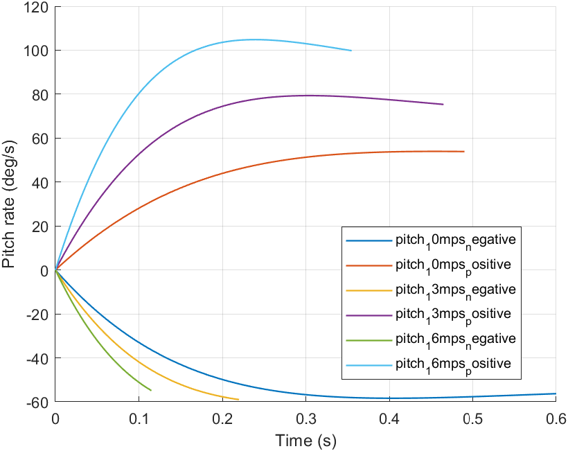
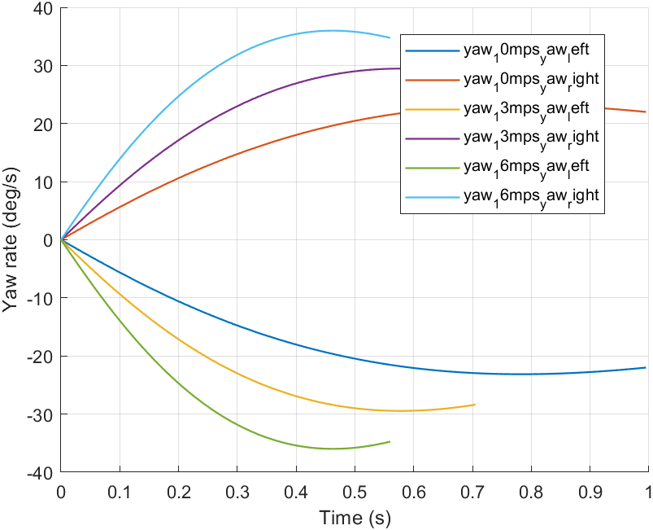
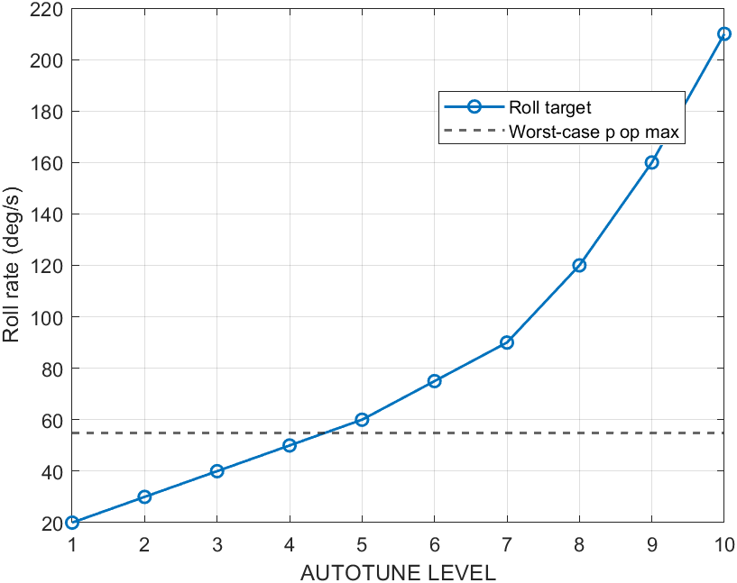
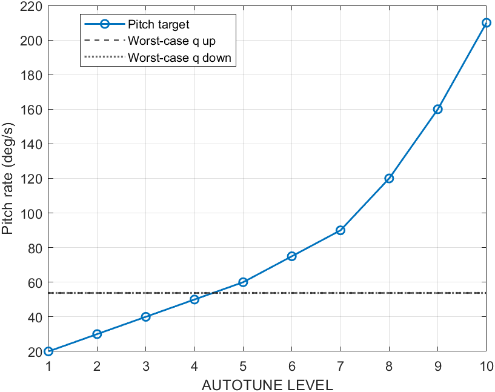

# UAV Autotune V5.4.1 Validation Fix Report

- Version: **V5.4.1-Validation-Fix**
- Status: **VALIDATION INCOMPLETE / NOT FLIGHT SIGN-OFF**
- Aircraft: **UAV_A**
- ArduPilot: **Plane-4.7.0**, commit `1511f27194f1dcc3728270883047bdf022b3fd53`
- V5.4 project: retained unchanged; this project and all V5.4.1 result campaigns are independent.
- Flight release: **not granted** while assumed surface installation data or incomplete Native AutoTune evidence remains.

## Executive conclusion

The V5.4 0.6 s fractional-pulse control-authority conclusion is invalidated. V5.4.1 uses the full command→PWM→surface→moment→angular-acceleration chain and envelope-limited endpoint tests.
Worst-case measured model capability is Roll 54.68 deg/s, Pitch-up 53.95 deg/s, Pitch-down 53.73 deg/s. The project screening rule classifies Levels 1–2 as COMFORTABLE, Level 3 as MATCHED, Level 4 as BOUNDARY, and Levels 5–10 as BEYOND_OPERATIONAL_CAPABILITY.
Yaw physical authority is reported independently. No Yaw AUTOTUNE_LEVEL target-rate relationship is invented because the pinned baseline has `YAW_RATE_ENABLE=0` and the source requires yaw rate control plus `ACRO_YAW_RATE>0`.
Native AutoTune completion is accepted only on the first exact axis `Finished` STATUSTEXT; it immediately neutralizes excitation, requests FBWA, and records the first event time.

Formal Level-2 repeatability outcome: Roll 3/3 official completions (PASS); Pitch 0/3 official completions (FAIL: all three reached the 180 s timeout without `Pitch: Finished`). The overall validation therefore remains incomplete.

## 1. Source data and surface mapping

Authoritative measured calibration: `C:/Users/dell/Desktop/260808试飞/等效舵机/pwm波到副翼偏角.xlsx`. It contains only the left-aileron PWM/angle curve. The workbook neutral 1410 μs overrides the 1500 μs text setting; no averaging is used.
The measured worksheet sign, installation direction, and physical endpoint magnitudes are separate fields. Right aileron, elevator, and rudder reuse/scale the left curve and are explicitly marked `ASSUMED_FROM_LEFT_AILERON`.

| Surface | Source | Direction | Min deg | Max deg | Neutral μs |
|---|---|---|---|---|---|
| Left Aileron | MEASURED | -1 | -30.55 | 37.85 | 1410 |
| Right Aileron | ASSUMED_FROM_LEFT_AILERON | +1 | -37.85 | 30.55 | 1410 |
| Elevator | ASSUMED_FROM_LEFT_AILERON | +1 | -12.00 | 10.00 | 1410 |
| Rudder | ASSUMED_FROM_LEFT_AILERON | -1 | -22.00 | 22.00 | 1410 |

### Direction-chain audit

| Axis | Command | PWM L/R/E/Rud | Surface L/R/E/Rud deg | Cl/Cm/Cn | Pass |
|---|---|---|---|---|---|
| roll | +1 | 2029 / 2029 / 1408 / 1410 | 37.85 / -37.85 / 0.05 / -0.00 | 0.26218 / -0.00027 / 0.00026 | PASS |
| roll | -1 | 1007 / 1007 / 1408 / 1410 | -30.55 / 30.55 / 0.05 / -0.00 | -0.21161 / -0.00027 / -0.00021 | PASS |
| pitch | +1 | 1410 / 1410 / 2029 / 1410 | -0.00 / 0.00 / -12.00 / -0.00 | -0.00000 / 0.31822 / 0.00000 | PASS |
| pitch | -1 | 1410 / 1410 / 1007 / 1410 | -0.00 / 0.00 / 10.00 / -0.00 | -0.00000 / -0.26342 / 0.00000 | PASS |
| yaw | +1 | 1410 / 1410 / 1408 / 1007 | -0.00 / 0.00 / 0.05 / -22.00 | -0.00152 / -0.00027 / 0.01672 | PASS |
| yaw | -1 | 1410 / 1410 / 1408 / 2029 | -0.00 / 0.00 / 0.05 / 22.00 | 0.00152 / -0.00027 / -0.01672 | PASS |

Both ailerons move in opposite aerodynamic directions for Roll±. The same-PWM mirrored model has asymmetric endpoint travel across Roll+ versus Roll−, but does **not** claim independently measured left/right differential magnitude at one command direction.

## 2. Physical control authority

Test mode is `PLANT_ONLY_CONTROL_AUTHORITY_TEST`. Every case is an independent simulation with no controller reuse and no Fast Restart. The surface begins at its physical endpoint; the run ends on angle completion or the first operational-envelope limit.

### Roll

| V m/s | Dir | T90 s | p avg deg/s | p op max deg/s | Limit |
|---|---|---|---|---|---|
| 10 | RIGHT | 1.620 | 55.56 | 67.58 | ANGLE_COMPLETE |
| 10 | LEFT | 1.930 | 46.63 | 54.68 | ANGLE_COMPLETE |
| 13 | RIGHT | 1.220 | 73.77 | 87.73 | ANGLE_COMPLETE |
| 13 | LEFT | 1.490 | 60.40 | 70.92 | ANGLE_COMPLETE |
| 16 | RIGHT | 0.965 | 93.26 | 107.85 | ANGLE_COMPLETE |
| 16 | LEFT | 1.185 | 75.95 | 87.15 | ANGLE_COMPLETE |

Roll β grows during the free bank-to-bank maneuver and is retained in the raw data; it is not silently used as a Roll completion metric. The formal Roll envelope is ±45° roll, α −5°…12°, and Va≥8 m/s.

### Pitch

| V m/s | Dir | Range deg | Time s | q avg deg/s | q op max deg/s | Limit |
|---|---|---|---|---|---|---|
| 10 | PITCH_UP | 30 |  |  | 53.95 | AOA_LIMITED |
| 10 | PITCH_DOWN | 30 |  |  | 58.38 | AOA_LIMITED |
| 13 | PITCH_UP | 30 | 0.465 | 64.52 | 79.33 | ANGLE_COMPLETE |
| 13 | PITCH_DOWN | 30 |  |  | 58.71 | AOA_LIMITED |
| 16 | PITCH_UP | 30 | 0.355 | 84.51 | 104.81 | ANGLE_COMPLETE |
| 16 | PITCH_DOWN | 30 |  |  | 53.73 | AOA_LIMITED |

`q_avg` and completion time are left blank whenever α/Va limits stop the maneuver. Pitch angle and flight-path angle are stored separately in every raw case.

Pitch initial states retain the trimmed angle of attack and construct flight-path angle as `gamma = theta - alpha`; pitch angle, AoA, and flight-path angle are logged separately.

### Yaw

| V m/s | Dir | r op max deg/s | β peak deg | p peak deg/s | K yaw-roll | Limit |
|---|---|---|---|---|---|---|
| 10 | YAW_RIGHT | 23.14 | 14.97 | 8.33 | 0.360 | BETA_LIMITED |
| 10 | YAW_LEFT | 23.14 | 14.97 | 8.33 | 0.360 | BETA_LIMITED |
| 13 | YAW_RIGHT | 29.45 | 14.97 | 10.59 | 0.360 | BETA_LIMITED |
| 13 | YAW_LEFT | 29.45 | 14.97 | 10.59 | 0.360 | BETA_LIMITED |
| 16 | YAW_RIGHT | 35.98 | 15.00 | 12.97 | 0.360 | BETA_LIMITED |
| 16 | YAW_LEFT | 35.98 | 15.00 | 12.97 | 0.360 | BETA_LIMITED |

All Yaw endpoint tests are β-limited at 15°. Roll/yaw coupling is about 0.36 in the modeled plant and is an explicit limitation, not hidden.

## 3. AUTOTUNE_LEVEL feasibility

The target-rate table (20, 30, 40, 50, 60, 75, 90, 120, 160, 210 deg/s) is from the pinned ArduPilot source. COMFORTABLE≤70%, MATCHED≤90%, BOUNDARY≤100%, and beyond>100% are **V5.4.1 project screening rules**, not ArduPilot rules.

| Level | Target | Governing ratio | Classification |
|---|---|---|---|
| 1 | 20 deg/s | 0.372 | COMFORTABLE |
| 2 | 30 deg/s | 0.558 | COMFORTABLE |
| 3 | 40 deg/s | 0.745 | MATCHED |
| 4 | 50 deg/s | 0.931 | BOUNDARY |
| 5 | 60 deg/s | 1.117 | BEYOND_OPERATIONAL_CAPABILITY |
| 6 | 75 deg/s | 1.396 | BEYOND_OPERATIONAL_CAPABILITY |
| 7 | 90 deg/s | 1.675 | BEYOND_OPERATIONAL_CAPABILITY |
| 8 | 120 deg/s | 2.234 | BEYOND_OPERATIONAL_CAPABILITY |
| 9 | 160 deg/s | 2.978 | BEYOND_OPERATIONAL_CAPABILITY |
| 10 | 210 deg/s | 3.909 | BEYOND_OPERATIONAL_CAPABILITY |

## 4. Native AutoTune completion and repeatability

- Repeatability campaign: `E:\动力学搭建\成品\UAV_Autotune_v5_4_1_Validation_Fix\results\v5_4_1\autotune_repeatability\20260825_184700_426_repeatability_level2`
- Repeatability status: **FAIL**
- Required: Roll 3/3 and Pitch 3/3 official completions, same Level/fidelity/seed, with CV≤15% for FF/P/I/D/RMAX/TCONST families.
- A running case is never scored as complete. `INCOMPLETE_TIMEOUT`, `ABORTED_SAFETY`, and communication/mode failures remain separate categories.

| Axis | Trial | Status | Completion | Finished s | Failure |
|---|---|---|---|---|---|
| roll | 1 | PASS | COMPLETE_OFFICIAL_FINISHED | 155.6 | NONE |
| roll | 2 | PASS | COMPLETE_OFFICIAL_FINISHED | 155.6 | NONE |
| roll | 3 | PASS | COMPLETE_OFFICIAL_FINISHED | 155.6 | NONE |
| pitch | 1 | FAIL | INCOMPLETE_TIMEOUT |  | INCOMPLETE_TIMEOUT |
| pitch | 2 | FAIL | INCOMPLETE_TIMEOUT |  | INCOMPLETE_TIMEOUT |
| pitch | 3 | FAIL | INCOMPLETE_TIMEOUT |  | INCOMPLETE_TIMEOUT |

### Roll parameter statistics

| Parameter | N | Mean | Std | CV | Minimum | Maximum | Pass |
|---|---|---|---|---|---|---|---|
| RLL_RATE_FF | 3 | 0.701963 | 1.35974e-16 | 1.93705e-16 | 0.701963 | 0.701963 | PASS |
| RLL_RATE_P | 3 | 0.978387 | 0 | 0 | 0.978387 | 0.978387 | PASS |
| RLL_RATE_I | 3 | 0.701963 | 1.35974e-16 | 1.93705e-16 | 0.701963 | 0.701963 | PASS |
| RLL_RATE_D | 3 | 0.0362958 | 0 | 0 | 0.0362958 | 0.0362958 | PASS |
| RLL2SRV_RMAX | 3 | 30 | 0 | 0 | 30 | 30 | PASS |
| RLL2SRV_TCONST | 3 | 0.9 | 0 | 0 | 0.9 | 0.9 | PASS |

### Pitch parameter statistics

| Parameter | N | Mean | Std | CV | Minimum | Maximum | Pass |
|---|---|---|---|---|---|---|---|
| PTCH_RATE_FF | 0 | N/A | N/A | N/A | N/A | N/A | FAIL |
| PTCH_RATE_P | 0 | N/A | N/A | N/A | N/A | N/A | FAIL |
| PTCH_RATE_I | 0 | N/A | N/A | N/A | N/A | N/A | FAIL |
| PTCH_RATE_D | 0 | N/A | N/A | N/A | N/A | N/A | FAIL |
| PTCH2SRV_RMAX_UP | 0 | N/A | N/A | N/A | N/A | N/A | FAIL |
| PTCH2SRV_RMAX_DN | 0 | N/A | N/A | N/A | N/A | N/A | FAIL |
| PTCH2SRV_TCONST | 0 | N/A | N/A | N/A | N/A | N/A | FAIL |

Every promoted `params_after.param` retains the actual runtime `AUTOTUNE_LEVEL`; missing Level metadata is a hard error.

## 5. Overshoot correction

Overshoot is normalized by step amplitude `desiredAfter-desiredBefore`, with direction-aware peak logic. Negative commands are no longer divided by the absolute command level.

| Case | Expected % | Calculated % | Pass |
|---|---|---|---|
| POSITIVE_0_TO_10 | 20.00 | 20.00 | PASS |
| NEGATIVE_0_TO_MINUS10 | 20.00 | 20.00 | PASS |
| NO_OVERSHOOT | 0.00 | 0.00 | PASS |

## 6. Direct answers to acceptance questions

### Q1 Why old 0.6 s method rejects fast Roll

A fast aircraft can cross ±45 deg before 0.6 s and was therefore rejected by the old full-pulse SafetyPass gate; that selection bias invalidates the old maximum-rate conclusion.

### Q2 Roll T90 / p_avg_90 / p_op_max

10 m/s: R 1.620/55.56/67.58; L 1.930/46.63/54.68; 13 m/s: R 1.220/73.77/87.73; L 1.490/60.40/70.92; 16 m/s: R 0.965/93.26/107.85; L 1.185/75.95/87.15

### Q3 Roll direction asymmetry

Yes. Right-minus-left p_op_max asymmetry is 10 m/s 23.6%, 13 m/s 23.7%, 16 m/s 23.8%; the modeled Roll+ direction is consistently stronger.

### Q4 Aileron direction correct

Yes; Roll± moment and p_dot signs pass.

### Q5 Aileron differential correct

The software applies independent min/max/direction fields, but installed differential is NOT hardware-confirmed because only the left aileron was measured.

### Q6 Pitch-up T / q_avg / q_op_max

10 m/s: T , q_avg , q_op_max 53.95 (AOA_LIMITED); 13 m/s: T 0.465, q_avg 64.52, q_op_max 79.33 (ANGLE_COMPLETE); 16 m/s: T 0.355, q_avg 84.51, q_op_max 104.81 (ANGLE_COMPLETE)

### Q7 Pitch-down T / q_avg / q_op_max

10 m/s: T , q_avg , q_op_max 58.38 (AOA_LIMITED); 13 m/s: T , q_avg , q_op_max 58.71 (AOA_LIMITED); 16 m/s: T , q_avg , q_op_max 53.73 (AOA_LIMITED)

### Q8 Pitch AoA limited

Yes. 10 m/s up and 10/13/16 m/s down are AOA_LIMITED; their completion time and q_avg remain blank.

### Q9 Yaw r_op_max / beta / coupling

10 m/s YAW_RIGHT: r 23.14, beta 14.97, K 0.360; 10 m/s YAW_LEFT: r 23.14, beta 14.97, K 0.360; 13 m/s YAW_RIGHT: r 29.45, beta 14.97, K 0.360; 13 m/s YAW_LEFT: r 29.45, beta 14.97, K 0.360; 16 m/s YAW_RIGHT: r 35.98, beta 15.00, K 0.360; 16 m/s YAW_LEFT: r 35.98, beta 15.00, K 0.360 (left/right are equal in the current symmetric assumed-rudder model; every case is beta-limited).

### Q10 Rudder Cn / r_dot direction

Yes; Yaw± Cn and r_dot signs pass the command→PWM→surface→moment→acceleration audit.

### Q11 Actual ArduPlane Yaw AutoTune logic

Pinned Plane-4.7.0 source starts only axes in AUTOTUNE_AXES. Yaw tuning additionally requires yaw rate control and ACRO_YAW_RATE>0; the pinned baseline has YAW_RATE_ENABLE=0, so no yaw target-rate/Level relationship is claimed.

### Q12 Overshoot fixed

Yes. Step amplitude is desired_after-desired_before; +10 and -10 standard cases both calculate 20%.

### Q13 First official Finished stops excitation

Yes for the completed axis: 3 Roll and 0 Pitch run(s) captured the first exact axis Finished event, immediately neutralized excitation, and requested FBWA. Pitch timeout runs correctly contain no false Finished event.

### Q14 Roll 3-run repeatability

PASS: Roll completed officially in 3/3 runs at 155.580 s. All six parameter-family CV values are effectively zero and below 15%.

### Q15 Pitch 3-run repeatability

FAIL: Pitch completed officially in 0/3 runs. All three formal runs ended as INCOMPLETE_TIMEOUT at 180 s, so N=0 parameter statistics are N/A and no params_after file is promoted.

### Q16 Cause if Pitch still differs greatly

Current observation, not a proven single root cause: 3/3 Pitch runs observed the D boundary and 0/3 observed the P boundary; each parsed run had 29 effective and 1 rejected excitations. The prior multi-fold Pitch FF spread remains inconclusive because no official Pitch final parameter set exists.

### Q17 params_after keeps real Level

The exporter requires the runtime AUTOTUNE_LEVEL and writes it into params_after.param; missing Level is a hard error. No incomplete run is promoted to params_after.

### Q18 Campaign traceable and non-overwriting

Yes. Every run has a timestamped campaign_id, immutable before snapshot, Level/seed/fidelity metadata, separate directory, and explicit INVALIDATED markers; no campaign is overwritten.

### Q19 Reasonable Level candidates

Physical screen supports Levels 1–2, Level 3 is matched, Level 4 boundary-only, Levels 5–10 beyond capability. None is a final tuned-parameter recommendation until repeatability passes.

### Q20 Ready for pre-first-flight guidance

No. Hardware travel/direction assumptions and Native AutoTune repeatability/official completion remain open, so no pre-first-flight parameter guidance is signed.

## 7. Recommendation and remaining limitations

No final Conservative/Balanced/Aggressive flight recommendation is issued. Physical screening supports Level 1–2 for subsequent controlled Native AutoTune work and Level 3 only as a matched engineering candidate, but repeatability/official-completion evidence is incomplete.
- Level 4 is a boundary-only research candidate; Levels 5–10 are excluded by the physical capability screen.
- Hardware bench verification is still required for right aileron, elevator, rudder, and actual installed sign/travel before flight.
- Pitch-down and low-speed pitch-up tests are AoA-limited; their requested angle completion time/rate is intentionally blank.
- Yaw tests are β-limited and strongly roll-coupled; no yaw Level recommendation is issued.
- This report does not use an extrapolated Q20 point.

## 8. Evidence index

- `surface_direction_audit/`
- `physical_control_authority/{roll,pitch,yaw}/`
- `overshoot_validation/`
- `autotune_level_feasibility/`
- `autotune_completion/`
- `autotune_repeatability/`
- `campaigns/`

Generated: 2026-08-25 20:29:21 +08:00
